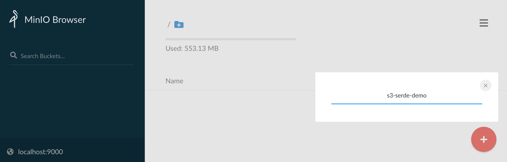

# Large Payload With Kafka and Spring Boot

This repository is a reference showcase of a Spring Boot application configured to handle large message ( > 2mb ) with Kafka.

## Two paths available

* [Oversized brokers](#oversized-brokers)
* [S3 Serde for clients](#s3-serde-for-clients)

## Setting up the infrastructure

This sample project is packaged with a `docker-compose.yml` file which embedds two Kafka cluster and a Minio S3 compliant server. One Kafka cluster is configured with `message.max.bytes` and `replica.fetch.max.bytes` to accept message up to 10mb. The other Kafka is vanilla with default values to showcase the S3 serde approach. Naturally, Minio will act as an S3 provider for the purpose of this demonstration.

The infrastructure can be brought up with this simple command:

```
$ docker-compose up -d
````

Once all data services are online, access the MinIO browser console at http://localhost:9000/ with the `minio / minio123` credentials and create a new s3 bucket named `s3-serde-demo`.



## The application

This Spring Boot application will demonstrate the two approaches through unit tests. 

### Running the tests

Just run the following command from a terminal and the unit tests will be executed against the provided infrastructure

```
$ ./mvnw test
```

This results in the execution of the `dev.daniellavoie.kafka.LargePayloadTest.sendLargeMessage()` routine with two seperate test context. 

One with a client configured for oversized settings. It will handle the 10mb message properly and report an expected error for the 100mb attempt.

The second test will run the same function but with the S3 Serde that involves no specific broker configuration and which will succesfully produce and consume the 10 and 100 mb messages.


## Oversized brokers

By configuring the brokers with oversized capacity, it is possible to send larger payload through Kafka but with the risk of creating unstabilities on the cluster.

Implementing this approach requires two actions:

* Configure the `max.request.size` on the Kafka client (see [application-oversized-broker.properties](src/main/resources/application-oversized-broker.properties)).
* Configure `message.max.bytes` and `replica.fetch.max.bytes` see env variables from `kafka-large` in [docker-compose.yml](docker-compose.yml).
`

## S3 Serde for clients

The second approach involves a third party s3 provider who will offload the actual payload from Kafka and rather pass S3 reference for the producers and consumers to exchange. With those reference and both clients have their own access to the S3 bucket and serializers can swap the reference from the actual payload store in S3.

This approach involves no code change and just configuration. Both the producers and consumers will have to load the S3 payload in memory and will required a heap sized accordinly.

The S3 Serde is a community project from https://github.com/bakdata/kafka-s3-backed-serde and is available on Maven Central through this dependency : 

```
    <dependency>
      <groupId>com.bakdata.kafka</groupId>
      <artifactId>s3-backed-serde</artifactId>
      <version>1.1.0</version>
    </dependency>

```

Warning: This Kafka Serde has dependencies on the Confluent public Maven repository. This repository can be added your pom.xml with this setting:

```
  <repositories>
    <repository>
      <id>confluent</id>
      <url>http://packages.confluent.io/maven/</url>
    </repository>
  </repositories>
```

Configuring the serializer and deserializer from the S3 Serde project is as simple as setting the following Kafka properties (see [application-s3-serde.properties](src/main/resources/application-s3-serde.properties)):

```
spring.kafka.producer.value-serializer=com.bakdata.kafka.S3BackedSerializer
spring.kafka.consumer.value-deserializer=com.bakdata.kafka.S3BackedDeserializer
spring.kafka.properties.s3backed.base.path=s3://s3-serde-demo
spring.kafka.properties.s3backed.access.key=minio
spring.kafka.properties.s3backed.secret.key=minio123
spring.kafka.properties.s3backed.endpoint=http://127.0.0.1:9000
spring.kafka.properties.s3backed.region=r1
spring.kafka.properties.s3backed.value.serde=org.apache.kafka.common.serialization.Serdes$StringSerde
````